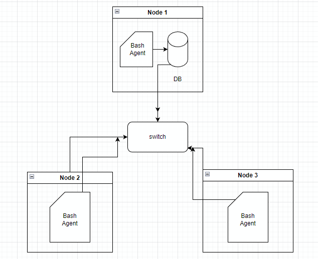

# Linux Cluster Monitoring Agent
This project is under development. Since this project follows
the GitFlow, the final work will be merged to the main branch 
after Team Code Team.
## Introduction
The objective of this project was to create a tool which allows the Linux Cluster Administration (LCA) team to Monitor each node or server present in a Linux cluster. In order to monitor a node the collection of the system's details such as the Hardware specifications and Resource usage data for each node was necessary.
With the use of Bash, docker, git, postgresql and a Remote Desktop with CentOS 7 installed, each feature was instantiated, implemented and tested.
Which allowed for the creation of a Minimum Viable Product (MVP) to be created with each feature merged together with reference to Gitflow. With the MVP created an LCA team would be able to use this project to gather data to in turn generate reports for future resource planning purposes, such as adding or decreasing the number of nodes required for their current purpose.

## Quick Start
````bash
./scripts/psql_docker.sh start|stop|create [db_username][db_password]

psql -h localhost -U postgres -d host_agent -f sql/ddl.sql

crontab -e
* * * * * bash /home/centos/dev/jrvs/bootcamp/linux_sql/host_agent/scripts/host_usage.sh localhost 5432 host_agent postgres password > /tmp/host_usage.log
````

## Implementation
For the implementation of this project background knowledge in; SSH, Bash, CLI, regex, docker and RDBMS was required.
After background knowledge is gained, a docker container to host a postgresql instance where data for monitoring can be hosted is created, done through the `pqsl_docker.sh` file.
Then two tables used to persist data and to perform data analytics were created `ddl.sql` displays the details of these tables.
The next step is to populate the tables with the data from each node bash scripts `host_info.sh` and `host_usage.sh` to grab the system details from the respective node and insert this data into the schema.
## Architecture



## Scripts
````bash
psql_docker.sh
host_info.sh
host_usage.sh
crontab

````
## Database Modelling

host_info table

| id  | Hostname | cpu_number | cpu_architecture |cpu_model | cpu_mhz | L2_cache | total_mem | timestamp |
|-----| ------- | ---------- | ---------------- | -------- | ------ | ------ | -------- | ------------------ |
| int | VARCHAR | int | VARCHAR | VARCHAR | int | int | int | UTC date |

host_usage table

| timestamp | host_id | memory_free | cpu_idle | cpu_kernel | disk_io | disk_available |
|-----------|---------|-------------|----------|------------|---------|----------------|
| date      | int     | int         | %        | %          | int     | int            |
## Test
The `psql -h localhost -U postgres -d host_agent -f sql/ddl.sql` script was used to test the creation of the tables 
To test the bash scripts located in `host_info` and `host_usage` for DDL each one was entered into the CLI in the following format: `echo "$command"`
 then added to their respective files.
## Deployment
This project was deployed by creating and initializing a docker container with a PostgreSQL instance and crontab to execute the `host_usage.sh` script every minute.
GitHub is used to manage the creation and merging of features for the MVP.

## Improvements
- update hardware info within a certain time period
- add warning log to system displaying when usage was over desired amount
- add Visualization of data 